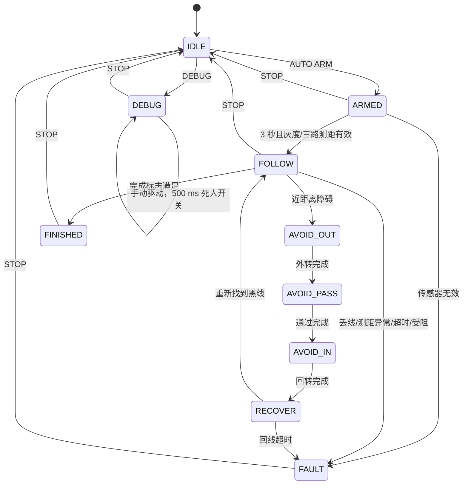

# 循迹避障小车程序

本工程以 STM32F407ZGT6 为车载控制器。比赛 PDF 要求车辆启动后全自动运行，不能由电脑遥控，因此自动状态机在 STM32 固件中执行。电脑上位机通过 **板载 CH340 USB 串口（USART1）**、**四针 JDY-31 经典蓝牙 SPP（USART3）**或接 USART3 的外置 USB-TTL 完成赛前调试和只读状态监测。两路 UART 均为 9600 8N1，独立接收和回复。2026-09-30 更新的蓝牙及八路灰度适配依据见 [模块更新说明](docs/MODULE_UPDATE_2026-09-30.md)，板载 USB 补充与下拉框报错修复见 [USB 串口排查](docs/USB_SERIAL_FIX_2026-09-30.md)。

依据：[比赛说明 PDF](docs/2026年循迹小车分散实训PPT.pdf)；硬件以 [2026-09-29 V3.1 接线基线](docs/2026929PINOUT.md) 为准，已同步 [PINOUT.md](PINOUT.md)、[if_car.ioc](if_car.ioc) 和固件。资料归档与审查见 [docs/README.md](docs/README.md)、[审查记录](docs/REVIEW_2026-09-30.md)。

## 运行

板载 CH340 串口已在 COM6 实机验证。若下载成功后 PING 没有回复，先按一次板上的 RESET，再连接实际 COM（9600 8N1）。本次板子原先停留系统 Bootloader，正常复位后 100 次 PING、5 次重连与 GUI 均通过；详见 [串口深查与验收](docs/SERIAL_AUDIT_2026-10-01.md)。端口号会随电脑连接变化，以设备列表为准。

```powershell
.\start_gui.cmd
```

工程启动脚本使用 `.venv`。板载 CH340 / JDY-31 / USB-TTL 只依赖 pyserial；换电脑或首次配置时先用本机实际 Python 创建环境，再安装依赖：

```powershell
py -m venv .venv
.\.venv\Scripts\python.exe -m pip install -r host/requirements.txt
.\start_gui.cmd
```

上位机可点“界面仿真”先检查界面与命令流程；仿真不等于实际车辆运动。**JDY-31 使用 Bluetooth 3.0 SPP**：先在 Windows 蓝牙设置中配对 `JDY-31-SPP`（出厂密码 `1234`），找到该设备的**出站 COM 口**，在界面串口下拉框选择它，点击“连接设备”。连接和 `PING` 握手在后台执行，期间可断开或退出；打开 COM 口成功后，还须收到 `PONG 2` 才算连通 MCU。普通 BLE 网页助手及 FFE0/FFE1/FFE2 通道用于旧 BT24，JDY-31 应使用 SPP COM 口。界面保留“旧 BT24 BLE”入口供旧模块使用。

界面分为“实时监测”“遥控回车”“调试控制”“PID 调参”“通信日志”五页，显示八路识别状态、三路距离、硬件故障、轮速趋势与参数保存状态。连接、查询、参数操作和关闭统一在后台串行执行。顶部“停止 / 待机”或 Esc 可停车；停止指令优先执行并取消尚未执行的请求，已在等待响应的请求仍须先完成或超时。调试时按住才驱动，松开、移出按钮、窗口失焦或换页即提交零 PWM；断开会在已确认 DEBUG 时尝试 STOP，AUTO 继续车端流程。通信日志可导出，画面保留约 500 行，导出保留最近 2000 条。

### 遥控回车与电机调参

测试后在“遥控回车”点“进入遥控”，按住前进/倒车/转舵按钮将小车开回。W / ↑ 前进，S / ↓ 倒车，A / ← 与 D / → 转舵，可组合使用；空格归零停车，Esc 退出至待机。键盘仅在遥控页、非文本输入框内响应；归零或停止后保持按下的键不会自行恢复驱动，需要松开再按。遥控使用直接 PWM（0–300‰），前轮舵机控制方向；此时轮速监看仍显示实测和 PWM，目标列为零。从完成或普通故障状态进入遥控会先 STOP；自动运行中须先自行停车。

“PID 调参”把电机参数和轮速监看并排放置，可同时查看左右目标、实测、PWM 和趋势，不用切换页面。抬起驱动轮，点“进入调试”，设置左右测试目标并按住“轮速测试”；`SPEED` 指令运行与自动模式相同的速度 PID，测试 PWM 默认上限 300‰，左右测试目标各为 0–500 编码器计数 / 10 ms。实际速度按编码器增量与采样时长归一化为计数 / 10 ms，使用绝对值；尚未标定车轮与编码器比例，不显示 m/s。

2026-10-01 新增“调试控制 → PWM 全范围测试入口”：填写 1–100% 上限，点击“停车并解锁此上限”，读回确认后进入静止 DEBUG。下方手动电机输入改为百分比，负值反转；解锁也适用于 PID 轮速测试，遥控回车仍最高 30%。STOP、退出 DEBUG、故障或运动超时会恢复 30%；静止编辑与普通松手保留本次解锁。需烧录本次新固件，旧固件会明确提示不支持，不能只更新 GUI。[解锁及速度/PWM 参数说明](docs/DEBUG_PWM_2026-10-01.md)。

松开测试后可编辑电机参数，点“停车并应用电机参数”依次停车、写入五项参数并读回，完成后保持 IDLE。再次进入调试并按住测试观察新响应；确认后停车保存 Flash。参数中的“自动目标速度”用于正常自动行驶和前馈比例，右侧的左右测试目标独立设置。正式自动模式上限保持 500‰。遥控及轮速测试均由车端 500 ms 看门狗约束；协议仿真的简化电机响应不代表实物标定。

使用闭环轮速测试前须烧录本次新固件；旧协议 v2 固件可能回复 `ERR COMMAND`，新 GUI 不会用 PWM 假装 PID 试跑。详细说明见 [遥控与轮速测试](docs/REMOTE_SPEED_2026-09-30.md)。

单独测试 DS3218MG 时，先断电连接舵机电源负极与 STM32 GND；5 V 电源正极接舵机正极，信号接 PE9。在“调试控制”进入调试，把左右电机设为 0，再按住“驱动 / 调舵”；松开会回到当前校准中位，单次命令超过 500 ms 也会回中。默认校准为 1500 ± 200 µs，可以先试 1400 / 1600 µs。新增官方 STM32、51、Arduino 例程的对照与当前接线问题见 [舵机排查记录](docs/SERVO_EXAMPLE_REVIEW_2026-09-30.md)。

### 舵机中位与对称限幅

在“PID 调参”页的“舵机中位 / 对称限幅”中设置中位脉宽和半摆幅，单位为整数微秒（1500 µs = 1.500 ms = 0.001500 s）。例如中位 1520、半摆幅 180，左右端点为 1340 / 1700 µs。两项通过 `SERVO SET` 成组应用，只能在硬件正常且待机时修改；半摆幅为 0 时固定在中位。端点必须在 500–2500 µs 内，这只是舵机信号的绝对范围，实际连杆可用摆幅需人工测定。

应用只修改 RAM；测试确认后单独保存舵机参数到 Flash，下次上电自动加载。舵机保存、加载和恢复默认与 PID 参数独立，原有 PID Flash 记录继续有效。未保存的变更在重启后丢弃；没有有效舵机记录时使用默认 1500 ± 200 µs。手动驱动、遥控、巡线、绕障、轮速测试回中及停车均使用当前中位与限幅。巡线 PID 的输出和积分抗饱和按半摆幅限幅，后轮差速与弯道减速使用当前中位到端点的归一化转向量；绕障转舵使用半摆幅的 90%。需要同时更新固件与上位机，旧固件不支持校准命令时界面显示不支持。

旧 BT24 实现已归档到 `host/legacy`；使用旧模块时安装可选依赖与运行入口：

```powershell
.\.venv\Scripts\python.exe -m pip install -r host/requirements-ble.txt
.\.venv\Scripts\python.exe -m host.legacy.ble_check --target BT24
```

全工程维护范围、修复与验证见 [维护记录](docs/MAINTENANCE_2026-09-30.md)。

模块与 MCU 间 USART3 为 **9600 8N1、无流控**。`AUTO ARM` 使车在 3 秒预备期后自主运行；赛前发送该命令后断开电脑，正式行驶过程中不要发送遥控命令。若不使用蓝牙，应另加实体启动开关并修改固件。

板载 CH340 / JDY-31 / USB-TTL 连接诊断（只读握手、状态、硬件和灰度查询，默认保存 JSON 到 `tmp`；先关闭占用该 COM 口的串口助手或 GUI）：

```powershell
.\.venv\Scripts\python.exe -m host.serial_check --port COM3
# 板载 CH340 选择实际 USB COM（本次用户为 COM5）；JDY-31 选择出站 SPP COM
# 工具流程仿真：--simulate（替代 --port COM3）
```

板载 USB 串口：核心板 **USB_TTL** 插座接 CH340C，再通过 **USART1 / PA9、PA10**进入 MCU；JP3 的 **1–2、3–4** 应分别装跳帽。烧录本次含 USART1 支持的固件，重新启动上位机并选择 CH340 的 COM（本次为 COM5）。打开前预设 DTR=False、RTS=False，正常车控不通过下载电路操作 RESET/BOOT0；ASCII 助手应使用 9600 8N1、关闭 DTR/RTS、发送 `PING` 并附加 LF 或 CRLF，预期 `PONG 2`。核心板另一个 USB_OTG 插座和 ST-Link 下载器不提供本工程的 UART 通道。

外置 USB-TTL 备用方式：模块与适配器选一路连接 USART3；适配器 TX 接 **PB11 / H2-29**，RX 接 **PB10 / H2-28**，GND 共地，使用 3.3 V 逻辑。切换时先断开 JDY-31 的 TX/RX，避免两个 TX 输出同时驱动 MCU RX。板载 USART1 与 JDY-31 的 USART3 可独立读取状态，但同一辆车的运动与调参操作应由一个控制端执行。

JDY-31 原厂手册给出的裸模块供电为 **1.8–3.6 V，推荐 3.3 V**。原载板 J3 是六针接口且 J3-5 为 5 V，四针底板须按丝印转接，不能按原六针顺序直接插接。四针底板是否允许 5 V 尚须确认其稳压规格；详细端点关系见 [PINOUT.md](PINOUT.md)。模块 AT 命令用 USB-TTL 单独配置并以 `\r\n` 结束；推荐确认 `AT+BAUD4`（9600）和 `AT+ENLOG0`（关闭状态日志）。小车协议仍用 `\n` 结束，GUI 不负责发送模块 AT 配置。

## 状态机



- `IDLE`、`FAULT`、`FINISHED`：电机 PWM 为零且 TB6612 `STBY` 为低，舵机回中。
- 硬件启动/微秒定时器故障（fault=6）：UART 通信保持可用，`HW?` 报告失败阶段，电机停机。拒绝自动/调试驱动，`STOP` 也不会清除硬件故障；修正原因后重新上电验证。
- `ARMED`：电机保持关闭，3 秒后须看到黑线并有三路测距结果，否则锁定故障。
- `FOLLOW`：每约 10 ms 读取八路灰度；巡线 PID 控制前轮舵机，并按转向量生成左右后轮不同的目标速度。左右速度 PID 分别用编码器反馈调整 PWM。短暂丢线减速，600 ms 未找回则停机。
- `AVOID_*` / `RECOVER`：用中路测距判断正前方障碍，根据左右测距选择余量更大的一侧，以暂定的时长绕行；2.5 秒内无法回线则停机。一次回线只增加一次绕障计数，侧向探头有 1.5 秒再触发间隔；中路近距离障碍和碰撞保护在该间隔内仍生效。计数不代表裁判确认的避障得分。
- `FINISHED`：目前设定为已离开起点全黑区域、运行至少 10 秒、八路灰度同时为黑且持续 20 ms。终点识别不再依赖避障计数。这仍是需要按阵列位置与赛道实测校准的终点特征。
- `DEBUG`：仅从待机进入，手动电机和独立左右目标速度测试默认最高 30% PWM，可在静止时显式解锁本次测试上限至 100%；舵机限幅由当前校准的中位 ± 半摆幅确定，默认 1300–1700 µs。必须持续按住 GUI 按钮或遥控键。运动中 500 ms 未收到新的 DRIVE/SPEED 时固件归零、清除速度目标并恢复 30% 上限。自动运行中拒绝调试驱动命令。
- 全程 5 分钟未完成时自动停机并进入 `FAULT`。

## 驱动与协议

| 驱动 | 实现 | 备注 |
| --- | --- | --- |
| 两后轮电机/TB6612 | `Core/Src/car_hw.c`，TIM5 CH3/CH4 + PC0–PC4 | 更新方向前关闭 STBY 并提交零 PWM；无驱动需求时拉低 STBY。 |
| 前轮舵机 | TIM1 CH1，PE9 | 50 Hz，默认中位 1500 µs、对称半摆幅 200 µs，可成组校准并保存。 |
| 左右编码器 | TIM3/TIM4 编码器模式（均 16 位） | 每控制周期读取有符号增量；自动行驶用增量绝对值作为前进速度反馈。须实测每 10 ms 的计数并校准 `target_ticks`。 |
| 八路灰度 | PF0–PF2 地址、PC5 数字输入 | 扫描地址 0–7，每次切换等待 500 µs，默认低电平为黑；按更新 F103 源码取值，教程和小车源码的 50 µs 差异见模块更新说明。 |
| 三路超声波 | PA1/PA5/PA7 TRIG，PF6/PF7/PF8 ECHO（TIM10/11/13 CH1） | 轮流触发，1 µs 计数、12 µs TRIG、30 ms 超时；无上升沿、无下降沿、卡高或不合格脉宽均无效，另有逐路原始诊断。 |
| 蓝牙串口 | JDY-31 SPP → USART3，PB10/PB11 | 9600 8N1，中断收发，ASCII 行协议；模块 `+...` 状态行不作为车控命令响应。 |
| 板载 USB 串口 | CH340C → USART1，PA9/PA10 | 9600 8N1，JP3 1–2 / 3–4；独立缓冲，按请求来源回复。 |

串口命令以 `\n` 结尾：**协议 v2**：`PING` → `PONG 2`；`STATUS?` → `STAT state fault line_bits left_mm center_mm right_mm enc_l enc_r obstacles motor_l motor_r steer_us`；`STOP` → `OK`；`AUTO ARM` → `OK`；`DEBUG` → `OK`；`DRIVE left right steer_us` → `OK`。无效或非法状态命令返回 `ERR ...`。灰度 `line_bits` 范围为 0–255（CH1 为 bit 0）；距离 `-1` 表示无有效测量，包括无回波；不再把无回波伪装成 6000 mm。自动状态下允许 `PING`、`STATUS?`、`RANGE? L/C/R`、`PID?`、`PID STORE?`、`SERVO?`、`SERVO STORE?`、`CTRL?` 读取信息和紧急 `STOP`，不接受人工驱动与参数修改。

### 超声波无信号排查

烧录新版后，在上位机“通信日志”页分别发送 `RANGE? L`、`RANGE? C`、`RANGE? R`。返回格式为 `RANGE side state valid echo_high pulse_us distance_mm age_ms triggers rises falls timeouts errors counter prescaler flags timer_running`。`valid=0` 时距离为 `-1`；尚无完整测量时 `age_ms=4294967295`。等待下一次 Echo 时可沿用上一有效距离，此时 `state` 为 `WAIT_RISE/WAIT_FALL`；`pulse_us` 是本次尝试的脉宽。诊断说明和示波器验收步骤见 [超声波联调记录](docs/ULTRASONIC_CHECK_2026-09-30.md)。

退出 GUI 连接后，可在待机下连续记录 30 秒，生成 CSV：

```powershell
python -m host.range_check --port COM3 --duration 30
# 板载 CH340 / USB-TTL 用实际 USB COM；JDY-31 用出站 SPP COM；旧 BT24 才使用 --ble BT24
```

工具只读取信息，要求车辆处于 `IDLE`，不发送电机驱动或启动命令。`NO_RISE` 表示尚未捕获上升沿，`NO_FALL` 表示有上升沿但缺下降沿；`IRQ_MISSED` 表示超时时捕获标志仍挂起，优先检查中断；`CLOCK_ERROR` 表示检测到定时器或延时异常。三路无回波会阻止自动启动；在模块型号和超量程行为得到实测确认前，保持此处理。

### PID 调试与通信日志

“通信日志”页显示逐条发送和接收的原始 ASCII 信息，也可输入单行命令。PID 参数读取与控制反馈在自动运行时只读；固件修改、保存和恢复参数仅允许在 `IDLE` 且硬件就绪。界面的电机参数可在暂停的 DEBUG 编辑，“停车并应用”会先 STOP 再修改。调参时先改 RAM 中的运行参数，确认效果后点击“保存到 Flash”；下次上电自动加载最新的有效记录。界面会显示当前参数是否已保存。参数按三位小数发送；`target_ticks` 舍入后必须大于零。

| 命令 | 返回 | 说明 |
| --- | --- | --- |
| `PID?` | `PID line_kp line_ki line_kd speed_kp speed_ki speed_kd target_ticks feedforward_pwm differential_gain curve_slowdown` | 读取当前参数，按此固定顺序输出小数。 |
| `PID SET <name> <value>` | `OK` 或 `ERR STATE/PARAM` | 修改一个参数，例如 `PID SET speed_kp 3.5`。 |
| `PID RESET` | `OK` 或 `ERR STATE` | 在待机状态恢复默认值。 |
| `PID SAVE` | `OK` 或 `ERR STATE/FLASH` | 把当前参数写入内部 Flash，并读回校验；已保存且未更改时不重复写入。 |
| `PID LOAD` | `OK` 或 `ERR STATE/EMPTY` | 放弃未保存的修改，重新加载 Flash 中的参数。 |
| `PID STORE?` | `STORE SAVED` 或 `STORE UNSAVED` | 检查当前参数是否与 Flash 中的有效记录一致。 |
| `SERVO?` | `SERVO center_us span_us` | 读取中位脉宽与对称半摆幅，整数微秒。 |
| `SERVO SET <center_us> <span_us>` | `OK` 或 `ERR STATE/PARAM` | 待机时成组修改；中位 ± 半摆幅须在 500–2500 µs 内，半摆幅可为 0。 |
| `SERVO SAVE` | `OK` 或 `ERR STATE/FLASH` | 单独保存舵机校准，完成标记最后写入，重复保存相同值不追加。 |
| `SERVO LOAD` | `OK` 或 `ERR STATE/EMPTY` | 待机时加载已保存的舵机校准。 |
| `SERVO RESET` | `OK` 或 `ERR STATE` | 待机时恢复运行校准为 1500 ± 200 µs；持久化默认值还需保存。 |
| `SERVO STORE?` | `SERVO STORE SAVED` 或 `SERVO STORE UNSAVED` | 检查当前舵机校准与 Flash 是否一致。 |
| `CTRL?` | `CTRL error measured_l measured_r target_l target_r pwm_l pwm_r steer_us` | 读取最近一次控制周期反馈。 |
| `DEBUG LIMIT?` | `LIMIT <permille>` | 读取当前调试上限，默认 300（30%），最高 1000（100%）。旧固件不支持。 |
| `DEBUG LIMIT <permille>` | `OK` 或 `ERR STATE_OR_RANGE/HARDWARE` | 仅静止 DEBUG 可设置 1–1000，本次会话有效；不会驱动电机。 |
| `SPEED <left> <right>` | `OK` 或 `ERR STATE_OR_RANGE/HARDWARE` | DEBUG 前进速度 PID 测试，目标各为 0–500 计数/10 ms，PWM 默认上限 300‰、可显式解锁至 1000‰；每 500 ms 内续发，`SPEED 0 0` 直接归零。 |
| `HW?` | `HW ready stage` | 读取执行器/计时器是否就绪以及启动失败阶段。`HW 1 READY` 为就绪，`HW 0 CLOCK` 等表示硬件故障；旧 v2 固件可能不支持此查询。 |
| `LINE?` | `LINE raw_bits line_bits black_level settle_us age_ms` | 读取最近完整八路扫描；两种位图均 CH1 为 bit 0，原始位 1 表示 OUT 高，归一位 1 表示识别到线。无完整扫描或硬件故障返回 `ERR NOT_READY`。上位机“实时监测”可点“读取原始 OUT”。 |

固化区是 STM32F407 的最后一个 128 KB Flash 扇区（sector 11，`0x080E0000` 起）；链接脚本已将它从程序区排除。PID 与舵机校准在相同大小的槽位中用不同记录标识分别追加，旧 PID 记录格式不变。每次保存带校验和与完成标记，掉电中断写入时仍可读取前一条有效记录；任一类型有有效记录时，空间耗尽会返回 `ERR FLASH`，不会擦掉已有参数。`PID RESET` 和 `SERVO RESET` 只修改各自当前运行参数；若要让默认值在下次上电时继续生效，还要保存对应参数组。烧录器若执行**全片擦除**，也会清掉此配置区。

速度单位是**编码器计数/10 ms**，不是 m/s：`target_ticks` 默认为 20，需要根据实际编码器与车轮测量后调整。`feedforward_pwm` 是直行时的基础 PWM（千分比），速度 PID 在此基础上纠偏，自动模式 PWM 上限为 500‰。`differential_gain` 决定转弯时左右后轮目标速度差；向右转时左轮更快、右轮更慢。`curve_slowdown` 决定大舵角时整体减速比例。上位机的“轮速反馈”显示目标与实测值，便于判断饱和、编码器接线和参数是否合理。

## 测试

```powershell
python tests/run_tests.py
```

测试覆盖车载状态转换、三路测距决策与故障、丢线停机、调试死人开关、终点、5 分钟超时、PID 参数恢复、全部 256 种八路灰度图样与原始电平诊断、捕获/编码器回绕、UART 丢字节、模块状态日志过滤、真实 C 应用的协议响应、SPP 串口配置与超时、旧 BLE 分包和连接释放、24 根信号在资料/引脚宏/IOC/CSV 间的一致性。交叉编译可验证 HAL 接口和链接；没有实车时无法验证实际 Flash 写入、电压、极性、机械转向、测距与避障轨迹。

## 实物联调前必须核对

1. 对照实际主控板与载板确认 [PINOUT.md](PINOUT.md) 中的 H1/H2 数字脚号和插接面方向。Echo 和灰度 OUT 按 V3.1 直连、无上下拉，电平条件与上电顺序按原接线基线第 5 节核验。共地并检查舵机、电机供电和 TB6612 额定电流。TB6612 `STBY` 应有硬件下拉，保证 MCU 复位和上电初始化前电机仍关闭。
2. 抬起驱动轮，先用调试模式验证左右电机方向、编码器正负、舵机左右极限、八路灰度地址与黑白极性、三路超声波是否测到正确方向。错误时先停机，再校准 `Core/Inc/car_config.h` 中的灰度顺序/极性和舵机方向；编码器相位与电机正方向须实测确认。
3. 根据实测车速、舵机转角、传感器安装角度与车宽，调整 `Core/Inc/car_config.h` 中的阈值和绕障时间，并在上位机中校准 PID 参数。当前绕障仍为时间控制，不能保证随机摆放障碍都能无碰撞绕过。
4. 终点线与起点线均约 500 mm × 20 mm，实际灰度阵列是否能稳定产生 `0xff` 仍需实测。四个障碍物的绕行/回线计数仅用于调试，不作为终点开关；赛段标识和计时光电门可能影响测距，需要与真正障碍区别并实测。
5. 现有引脚表未定义实体急停或启动开关。建议在正式赛前增加物理断电/急停与本地启动方式；软件 `STOP` 只是调试辅助，不能替代硬件断电。

## 工程分层与标定

- `main.c` / `stm32f4xx_hal_msp.c` / `if_car.ioc`：硬件引脚、时钟与初始化，GPIOG/PG10 先于灰度和舵机初始化。
- `car_config.h`：传感器通道数、地址顺序、极性、脉宽、测距阈值和绕障时长。
- `car_hw.c`：三路捕获、8 路数字采样、16 位编码器、PWM 和 UART；异常入口可在 HAL 句柄尚未初始化时切断电机。
- `car_logic.c` / `car_pid.c`：车载自主状态机与控制计算，不依赖 HAL。
- `car_pid_store.c`：原有 PID Flash 记录格式与保留区。
- `host/protocol.py`：ASCII v2 协议、板载 CH340 / JDY-31 SPP / USB-TTL 串口、协议仿真。
- `host/session.py`：后台会话、命令队列、停止优先级与连接生命周期。
- `host/gui.py` / `host/ui.py`：界面控制器与视图组件。
- `host/serial_check.py` / `host/range_check.py`：只读连接、灰度与超声波诊断；`host/legacy/` 保留旧 BT24 BLE 支持。

固件与上位机应一起升级。JDY-31 SPP 使用 Windows 虚拟 COM，UART 设置为 9600 8N1、无流控，普通命令等待 2 秒，保存 Flash 等待 5 秒。超时、不完整行、部分写入或多余响应会废弃会话，须重新连接，避免把错位响应当成下一条命令的确认。旧 BT24 BLE 支持保留通知分包及按特征属性写入。

交叉构建：

```powershell
cmake --preset Debug
cmake --build --preset Debug
cmake --preset Release
cmake --build --preset Release
```

构建会生成 `build/Debug`、`build/Release` 下的 `if_car.elf`、`if_car.hex`、`if_car.bin`。下午联调可使用 Debug 的 HEX/ELF，带调试符号的 ELF 便于断点排查；BIN 的加载地址为 `0x08000000`。

更新的八路灰度 PDF 和官方 RAR 源码已核对，并归档相关原件到 `docs/modules/line_sensor`。HC-SR04-P 完整手册、D24A 电路图和实际载板 `.epro2` 仍未收到；编译结果不能证明电平、供电、安装方向或 PCB 已通过实物验收。
