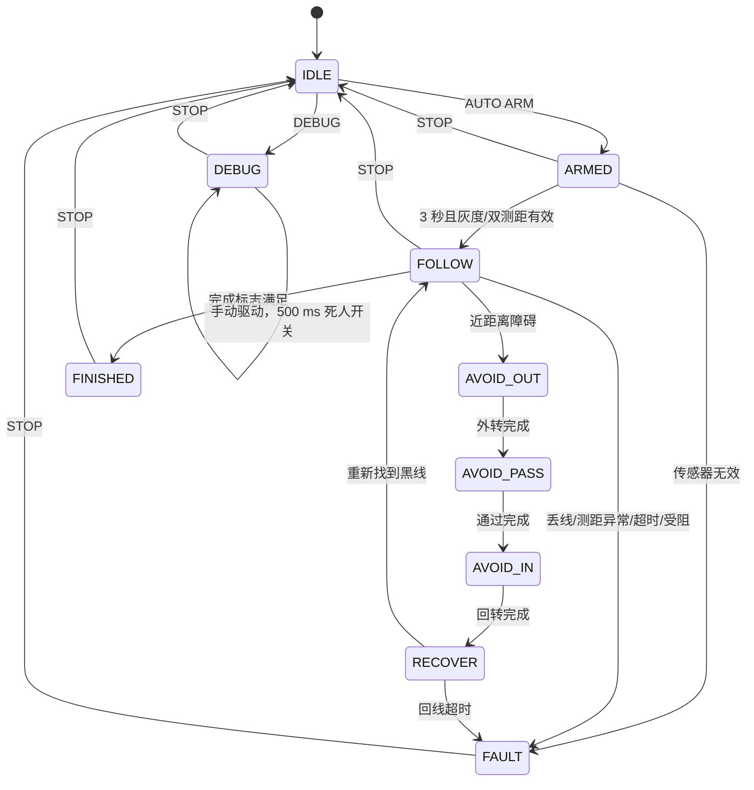

# 循迹避障小车程序

本工程以 STM32F407ZGT6 为车载控制器。比赛 PDF 要求车辆启动后全自动运行，不能由电脑遥控，因此自动状态机在 STM32 固件中执行。电脑上位机通过 USART3 蓝牙串口完成赛前调试和只读状态监测。

依据：[比赛说明 PDF](docs/2026年循迹小车分散实训PPT.pdf)；具体引脚以已有的 [PINOUT.md](PINOUT.md) 和 [if_car.ioc](if_car.ioc) 为准。

## 运行

```powershell
cmake --preset Debug
cmake --build --preset Debug
python -m pip install -r host/requirements.txt
python -m host.gui
```

上位机可点“界面仿真”先检查界面与命令流程；仿真不等于实际车辆运动。实物使用蓝牙模块对应的 Windows COM 口，USART3 为 **9600 8N1**。`AUTO ARM` 使车在 3 秒预备期后自主运行；赛前发送该命令后断开电脑，正式行驶过程中不要发送遥控命令。若不使用蓝牙，应另加实体启动开关并修改固件。

## 状态机



- `IDLE`、`FAULT`、`FINISHED`：电机 PWM 为零且 TB6612 `STBY` 为低，舵机回中。
- `ARMED`：电机保持关闭，3 秒后须看到黑线并有两侧测距结果，否则锁定故障。
- `FOLLOW`：每 10 ms 读取六路灰度，以加权线偏差控制前轮舵机，两后轮以保守 25% PWM 前进。短暂丢线减速，600 ms 未找回则停机。
- `AVOID_*` / `RECOVER`：根据左右测距选择远离障碍的一侧，以暂定的时长绕行；2.5 秒内无法回线则停机。一次回线只计一次避障，并有 1.5 秒再触发间隔。
- `FINISHED`：目前设定为经过至少 4 次避障、运行至少 10 秒、六路灰度同时为黑且持续 20 ms。它是暂定的终点识别条件。
- `DEBUG`：仅从待机进入，手动电机命令限制为 ±30% PWM、舵机 1300–1700 µs；必须持续按住 GUI 按钮。500 ms 未收到新驱动命令时固件将电机归零。自动运行中拒绝调试驱动命令。
- 全程 5 分钟未完成时自动停机并进入 `FAULT`。

## 驱动与协议

| 驱动 | 实现 | 备注 |
| --- | --- | --- |
| 两后轮电机/TB6612 | `Core/Src/car_hw.c`，TIM3 PWM + PD0–PD4 | 换向前先把 PWM 置零；无驱动需求时拉低 STBY。 |
| 前轮舵机 | TIM1 CH1，PE9 | 50 Hz，中心 1500 µs。 |
| 左右编码器 | TIM2/TIM4 编码器模式 | 每控制周期读取有符号增量，GUI 遥测可观察；轮径未知，尚未做速度闭环。 |
| 六路灰度 | PF0–PF2 地址、PF3 输入 | 扫描地址 0–5，默认低电平为黑。 |
| 双超声波 | PD5/PD6 TRIG，TIM9 CH1/CH2 ECHO | 轮流触发，1 µs 计数、上/下降沿捕获；30 ms 无回波按超出量程 6000 mm 处理。 |
| 蓝牙串口 | USART3，PB10/PB11 | 中断收发，ASCII 行协议。 |

串口命令以 `\n` 结尾：`PING` → `PONG 1`；`STATUS?` → `STAT state fault line_bits left_mm right_mm enc_l enc_r obstacles motor_l motor_r steer_us`；`STOP` → `OK`；`AUTO ARM` → `OK`；`DEBUG` → `OK`；`DRIVE left right steer_us` → `OK`。无效或非法状态命令返回 `ERR ...`。距离 `-1` 表示驱动无效，`6000` 表示本次无回波或超出量程，不能据此判断传感器是否接好。自动状态下除 `PING`、`STATUS?`、紧急 `STOP` 外不接受人工控制。

## 测试

```powershell
python tests/run_tests.py
```

测试覆盖车载状态转换、绕障、丢线停机、调试死人开关、终点、5 分钟超时及上位机协议校验。交叉编译可验证 HAL 接口和链接；没有实车时无法验证电压、极性、机械转向、实际测距与避障轨迹。

## 实物联调前必须核对

1. 对照实际主控板原理图检查 [PINOUT.md](PINOUT.md) 中的封装脚号；超声波 ECHO 若为 5 V，必须在 MCU 输入前降到允许范围。共地并检查舵机、电机供电和 TB6612 额定电流。TB6612 `STBY` 应有硬件下拉，保证 MCU 复位和上电初始化前电机仍关闭。
2. 抬起驱动轮，先用调试模式验证左右电机方向、编码器正负、舵机左右极限、六路灰度地址与黑白极性、两侧超声波是否测到正确方向。错误时先停机，再改 `Core/Src/car_hw.c` 中的映射/极性。
3. 根据实测车速、舵机转角、传感器安装角度与车宽，调整 `Core/Src/car_logic.c` 顶部的阈值和绕障时间。当前绕障为时间控制，不能保证随机摆放障碍都能无碰撞绕过；编码器增量可用于下一轮改成距离闭环。
4. 终点线与起点线均约 500 mm × 20 mm，实际灰度阵列是否能稳定产生 `0x3f` 仍需实测。若四个障碍物有任一个漏检，当前终点条件不会触发，会在 5 分钟时安全停机。
5. 现有引脚表未定义实体急停或启动开关。建议在正式赛前增加物理断电/急停与本地启动方式；软件 `STOP` 只是调试辅助，不能替代硬件断电。
